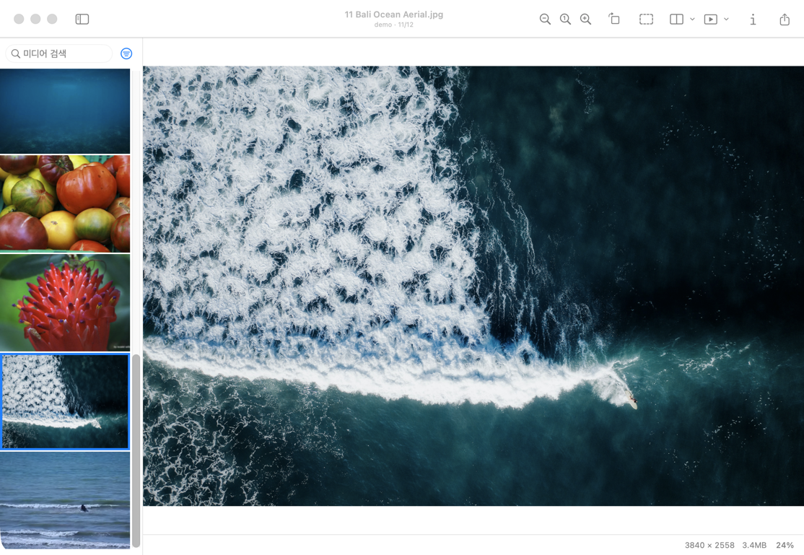
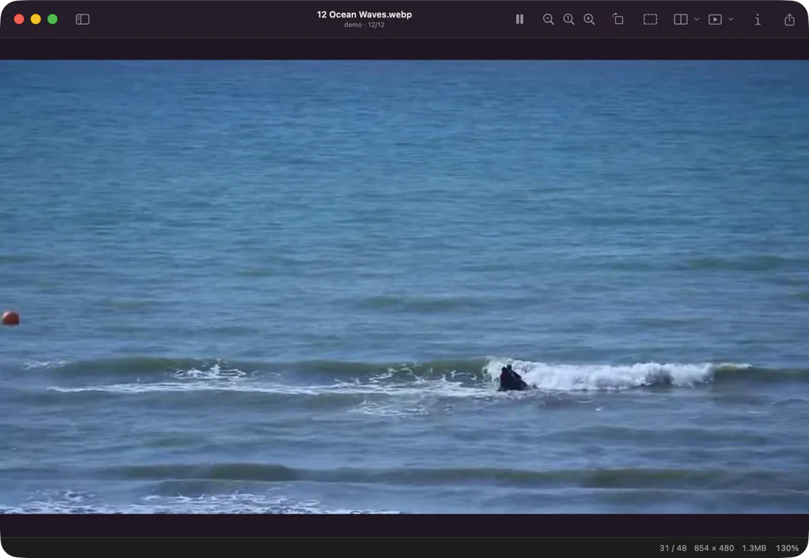

  

<h1 align="center">This is a Viewer</h1>

  <strong>A fast, native macOS viewer for still images and animation.</strong>

Open still images and play GIF, APNG and animated WebP. Browse folders and
ZIP/CBZ archives with single-page, two-page and webtoon layouts, or run a
slideshow.

## Download

**[Download the latest release](https://github.com/4celain/this-is-a-viewer/releases/latest)**

Download the notarized DMG and move the app to the Applications folder.

> [!NOTE]
> Requires an Apple Silicon Mac running macOS 14 Sonoma or later.

## Highlights

- JPEG, PNG/APNG, GIF, WebP, HEIC/HEIF, AVIF, TIFF, BMP, ICO and DDS
- Playback, pause and frame navigation for GIF, APNG and animated WebP
- Natural sorting across files, folders and ZIP/CBZ archives
- A resizable thumbnail sidebar with configurable columns
- Single-page, two-page and webtoon layouts, plus slideshows
- Zoom, rotation, Show in Finder, sharing and image information
- Move to Trash confirmation and safeguards for original files
- English, Korean, Japanese, Simplified Chinese and Traditional Chinese,
  with VoiceOver support

Every viewing feature is free. The app contains no ads, accounts, analytics or
tracking, and never modifies an original file unless you explicitly request it.

## Animation

GIF, APNG and animated WebP play with pause and frame navigation controls.

## Updates

The Direct build supports signed updates through Sparkle. Automatic checks are
enabled only with your permission.

## Support

- [Support](SUPPORT.md)
- [Report a bug](https://github.com/4celain/this-is-a-viewer/issues/new)
- [Privacy Policy](PRIVACY.md)
- [Third-party notices](THIRD_PARTY_NOTICES.txt)

Please do not post images, file names, local paths or other private information
in a public issue.

## Repository notice

This is a distribution repository for downloads, updates and issue reports.
It does not contain the application source code.

<strong>한국어 안내</strong>

This is a Viewer는 이미지를 빠르게 열고 자연스럽게 넘겨 보는 macOS
네이티브 이미지 뷰어입니다. 정지 이미지와 GIF·APNG·animated WebP,
폴더와 ZIP/CBZ 탐색, 한 장·두 장·웹툰 보기와 슬라이드쇼를 지원합니다.

### 다운로드

[최신 버전 다운로드](https://github.com/4celain/this-is-a-viewer/releases/latest)

- Apple Silicon Mac
- macOS 14 Sonoma 이상

공증된 DMG를 내려받아 앱을 Applications 폴더로 옮기면 됩니다.

### 주요 기능

- JPEG, PNG/APNG, GIF, WebP, HEIC/HEIF, AVIF, TIFF, BMP, ICO, DDS
- GIF·APNG·animated WebP 재생, 일시정지와 프레임 이동
- 여러 파일, 폴더, ZIP/CBZ와 자연 정렬 탐색
- 크기 조절·다중 열을 지원하는 썸네일 사이드바
- 한 장, 두 장, 웹툰 보기와 슬라이드쇼
- 확대, 회전, Finder에서 보기, 공유와 이미지 정보
- 확인 가능한 휴지통 이동과 원본 보호
- 영어, 한국어, 일본어, 중국어 간체·번체와 VoiceOver

모든 보기 기능은 무료입니다. 광고·계정·분석·추적을 포함하지 않으며,
사용자가 명시적으로 요청하지 않으면 원본 파일을 수정하지 않습니다.

### 업데이트

Direct판은 Sparkle을 통한 서명된 업데이트를 지원하며, 자동 확인은 사용자
동의 후에만 활성화됩니다.

### 지원

- [지원 안내](SUPPORT.md)
- [버그 제보](https://github.com/4celain/this-is-a-viewer/issues/new)
- [개인정보 처리방침](PRIVACY.md)
- [오픈소스 고지](THIRD_PARTY_NOTICES.txt)

공개 이슈에는 이미지, 파일명, 로컬 경로와 같은 개인정보를 첨부하지
마십시오.

### 저장소 안내

이 저장소는 다운로드, 자동 업데이트와 문제 제보를 위한 배포
저장소입니다. 애플리케이션 소스 코드는 포함하지 않습니다.

Copyright © 2026 4celain. All rights reserved.
